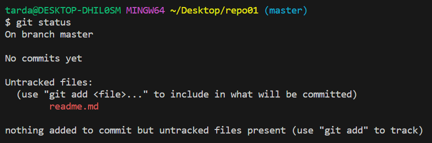
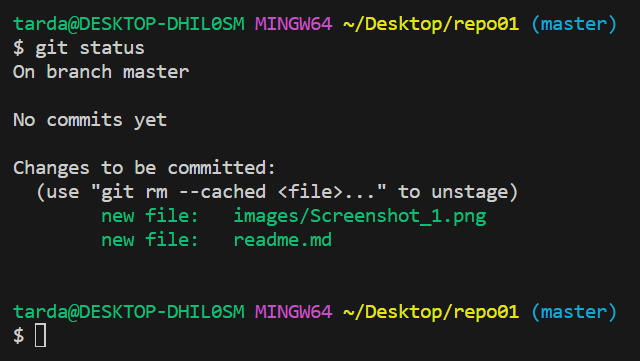
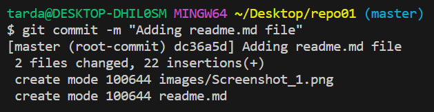
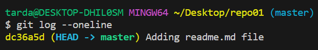
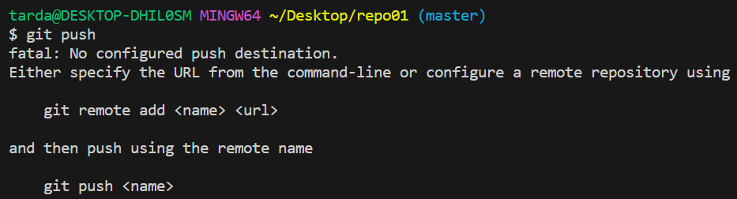
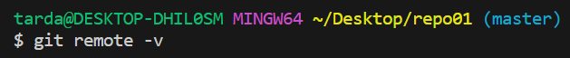

# Ejercicio 01
📌 1.1 - Crea un directorio llamado repo01 en local (desde tu máquina) y ejecuta el comando pertinente para ue dicho directorio se transofrme en el repositorio local ¿Cómo podemos identificar que el repositorio se ha inicializado?  

``cd /desktop`` → Hemos ido hacía desktop desde el directorio por defecto (~) 

``mkdir repo01`` → Hemos creado un repositorio para inicializar el repositorio en su interior.

``git init`` → Inicializa el repositorio y crea un directorio .git (oculto) que contendrá lo necesario para que el directorio sea considero un repositorio.  

``git status`` → Permite ver el estado del repositorio.  
⁉ Actualmente no tiene commits por lo que vamos a crear ficheros para poder realizar un commit.

📌 1.2 - Añade un documento llamado readme.md dentro del repositorio y documento en su interior todos los pasos ue vas realizando para crear el repositorio, etc.

``readme.md`` → Realizo la creación del fichero readme.md para poder integrar/escribir la documentación del ejercicio dentro del repositorio.

``git status`` → Me mostrará que tenemos un fichero untracked que aún es conocido por el repositorio y nos sugiere que hagamos un ``git add`` para añadirlo al ``staging Area`` dentro del repositorio.

``git add .`` → Podríamos añadir el fichero con ``git add .`` lo que añadiria todas los modificaciones que hayamos realizado en el repositorio al SA, o bien ``git add readme.md`` que nos añadiría exclusivamente este fichero a dicha capa.  

``git commit -m "Message"`` → Nos permite crear el commit con lo que hemos pasado al Staging Area (SA)

``git log --oneline`` → Permite visualizar si hemos realizado algún commit dentro del repositorio

``git push`` → Inicialmente no nos va a dejar realizar el push ya que no tenemos definido un remote (destino).
  

Podemos confirmar estos mismo haciendo un ``git remote -v`` , el cual no mostrará ningún destino.

 

Una vez en este punto vamos a crear un repositorio remoto el cual asociaremos a nuestro repositorio local.  
